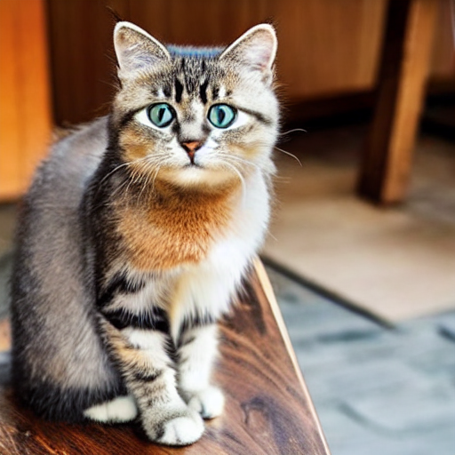

# Stable Diffusion Flask Web App

A simple web application that generates images from text prompts using Stable Diffusion.

---

## Requirements
- **Python**: 3.10.11 (tested)
- **Hardware**: CUDA-enabled GPU recommended (optional)

---

## Features
- Text-to-image generation with **Stable Diffusion v1.5**
- Simple and clean web interface built with **Flask**
- Generated images are automatically saved in `static/outputs/`


## Installation

1. Clone this repository:
   ```bash
   git clone https://github.com/mesut-by/stable-diffusion-flask-app-T2I.git
   cd stable-diffusion-flask-app-T2I
2. Create and activate a virtual environment:

   ```bash
   python -m venv venv
   source venv/bin/activate   # For Linux/Mac
   venv\Scripts\activate      # For Windows
   ```

3. Install dependencies:

   ```bash
   pip install -r requirements.txt
   ```

---

## Performance Note
- The app automatically falls back to **CPU** if a compatible CUDA-enabled GPU or drivers are not available.
- Running on **CPU** works for all users but image generation may take significantly longer (≈30–60 seconds per image).
- For **GPU acceleration** (recommended):
  1. Use a CUDA-supported NVIDIA GPU with the correct drivers installed.
  2. **After installing all dependencies from `requirements.txt`,** install the appropriate CUDA-enabled PyTorch for your system.  
     The following command is for **CUDA 12.1** (one of the most common versions):
     ```bash
     pip install torch torchvision torchaudio --index-url https://download.pytorch.org/whl/cu121
     ```
  3. If your system requires a different CUDA version, please refer to the [official PyTorch installation guide](https://pytorch.org/get-started/locally/).


---

## Usage

1. Run the Flask app:

   ```bash
   python app.py
   ```

2. Open your browser:

   ```
   http://127.0.0.1:5000
   ```

3. Enter a text prompt and generate an image.

---


## Example Results

| Prompt                                   | Output Image                                                                                         |
| ---------------------------------------- | ---------------------------------------------------------------------------------------------------- |
| *"a futuristic city skyline at sunset"*  |  |
| *"a cute cat sitting on a wooden table"* |               |


---

## Notes

* The first run may take longer because the model will be downloaded (\~4GB).
* This app is for local testing only and not optimized for production.

---
